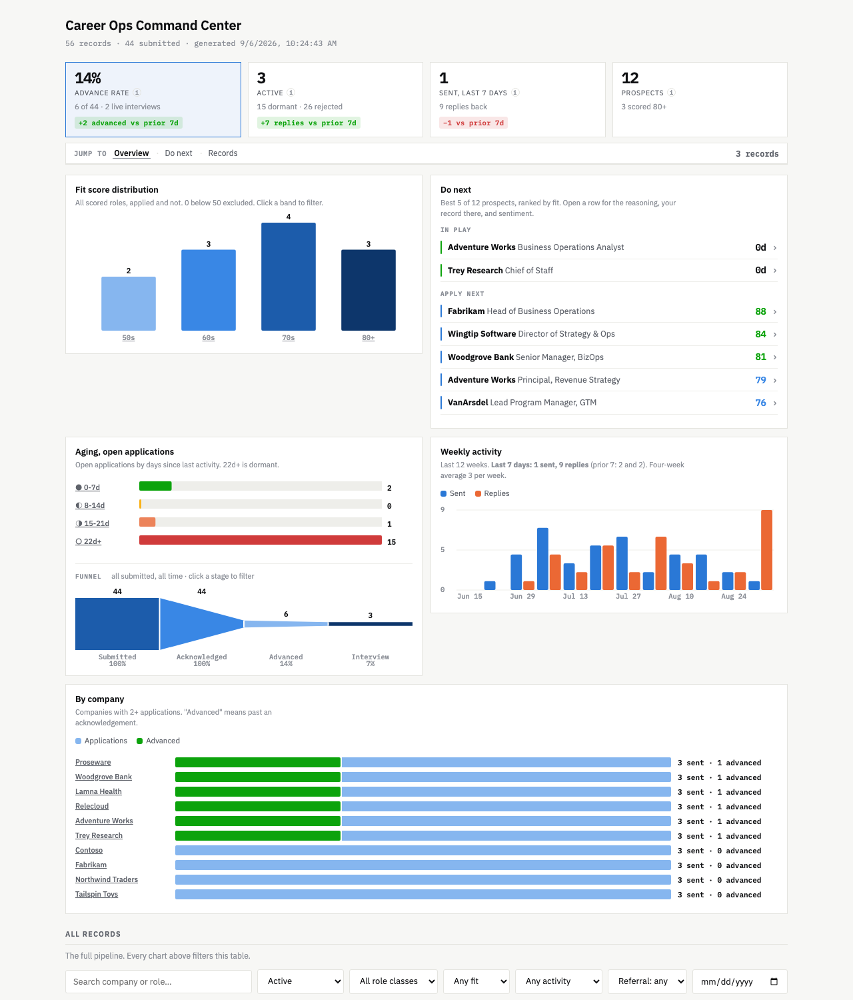

# Career Ops

A self-hosted job-search pipeline. It finds roles on public ATS boards, scores them
against your profile, reconstructs your application history from Gmail, and renders a
dashboard. Local Python and SQLite, no hosted services, no account to create.

It was built to replace a spreadsheet that had one row per email, which is why it kept
sender addresses in a "Company" column and could not answer "how many places have I
actually applied?"



## Try it in two minutes, no credentials

```bash
git clone https://github.com/bsunter93/careerops && cd careerops
python3 -m venv .venv && .venv/bin/pip install -r requirements.txt
.venv/bin/python -m careerops.cli demo --open
```

That seeds a synthetic pipeline and opens the dashboard above. It writes to its own
`demo.db` and never touches a real database, so it is also the safe way to demo this on
a shared screen.

Board discovery works with no credentials either:

```bash
cp config.example.json config.json && cp profile.example.md profile.md
.venv/bin/python -m careerops.cli init
.venv/bin/python -m careerops.cli discover     # polls live Greenhouse/Ashby/Lever boards
```

Credentials only buy you two things: an API key scores the roles discovery finds, and
Gmail access reconstructs what happened after you applied.

## The one idea

**Applications are entities with derived state. Emails are events that mutate it.**

Everything else follows. Status is never hand-edited; `recompute_status()` reads the
event log and derives it, and a rank table makes it monotonic so a late acknowledgement
cannot downgrade an interview. Re-running any command is safe, because events key on
their Gmail message id.

```
companies -> roles -> applications -> events
                                  \-> artifacts, review_queue, portal_snapshot
```

## What it does

```
discover   poll Greenhouse / Ashby / Lever board APIs for matching roles
fit        score each JD against profile.md, with reasoning, via the Anthropic API
resume     generate a tailored one-page .docx from one master file plus the fit analysis
sync       read Gmail, classify each message, attach it to the right application
intel      fetch public employee sentiment per company, with sources
dashboard  render a single self-contained HTML file
```

## Full setup

**1. Configure**

```bash
cp .env.example .env
```

Then edit `config.json`, `profile.md` and `.env`. `profile.md` is the one that matters: a
vague profile produces confident nonsense, because the scorer has nothing concrete to
weigh against. All three are gitignored.

**2. An Anthropic API key** in `.env`. Required for `fit` and `intel`. Without it,
`discover` still finds roles but nothing surfaces as a prospect, because scoring is what
promotes a discovered role into the pipeline. Scoring a couple of hundred roles costs a
few dollars.

**3. Gmail access (about 20 minutes, and the only tedious part)**

Create a Google Cloud project, enable the Gmail API, configure an OAuth consent screen
as **External / Testing**, add yourself as a test user, then create an **OAuth client ID**
of type *Desktop app* and download it as `credentials.json` into the repo root. The scope
used is `gmail.readonly`. Nothing is ever sent anywhere; the token stays in `token.json`.

**4. Check it**

```bash
.venv/bin/python -m careerops.cli doctor      # what is configured, what is missing
.venv/bin/python -m careerops.cli init
```

## Use

```bash
python3 -m careerops.cli discover             # poll the boards in config.json
python3 -m careerops.cli fit --limit 20       # score what was found
python3 -m careerops.cli prospects            # ranked, with the reasoning
python3 -m careerops.cli resume 51 --verify   # tailored .docx, page-checked in Word
python3 -m careerops.cli apply 51             # record that you submitted it
python3 -m careerops.cli sync --since 1y      # pull and classify Gmail
python3 -m careerops.cli resolve              # merge duplicates, drain the review queue
python3 -m careerops.cli refresh --open      # sync, resolve, discover, score, render
python3 -m careerops.cli dashboard --open
python3 -m careerops.cli demo --open          # synthetic data, separate database
python3 -m careerops.cli corpus               # re-check the classifier against real mail
python3 -m careerops.cli snooze 51 --days 30  # hide a prospect from Do next
python3 -m careerops.cli serve                # powers the dashboard buttons
```

`why <id>` explains any single application. `review` shows what the classifier refused to
guess at. `analytics` prints traction by company, channel and referral.

`serve` runs a small localhost server so the dashboard's own buttons work: generating a
tailored resume, and snoozing a role you do not want to see for a month. Both fall back
to copying the equivalent command when it is not running, and say so rather than failing
quietly.

## Design notes

**[CLAUDE.md](CLAUDE.md) is the interesting document.** It is the list of invariants this
system holds, each one paired with the bug that produced it: the day 49 discovered roles
silently became "applied", the ATS boilerplate that manufactured 22 interviews out of 7,
the Gmail query that dropped a year of one company's mail because its subject line said
"Follow-Up" instead of "application".

Five rules do most of the work:

- **Status is derived, never written.** A system that cannot recompute its own conclusions
  cannot be corrected.
- **Never guess.** Below a confidence floor, or missing a company or role, an event goes to
  a review queue. No JD means no fit score. Absent data beats wrong data.
- **Events keep their body.** Reclassifying without the source text once destroyed 48
  genuine rejections, because rejection language lives in the body, not the subject.
- **Reference data never writes state.** The employer portal and public sentiment inform
  the human. They never move a status or a score.
- **A fix that reaches only new data leaves stored data wrong.** Four separate rules were
  written to prevent the next bad row while leaving every existing one standing. Corrective
  rules now ship with their retroactive half and run on every `resolve`.

The classifier scores every candidate verdict and takes the winner only if it beats the
runner-up by a margin; anything closer is `unresolved` and goes to review. Weighting
evidence by *where* it appeared matters more than the patterns themselves: a bare word in
a body is not a phrase in a subject line, and treating them alike is what filed
acknowledgements as recruiter outreach and newsletters as interviews.

## Limits

- Self-hosted and single-user by design. It reads your inbox; that should stay on your machine.
- Public board APIs only. No LinkedIn or Indeed scraping.
- Page counts for generated resumes are verified through real Word via AppleScript, because
  Quick Look substitutes fonts and will happily report one page for a two-page document.
- `resume/master.json` is yours to write. The generator is generic; the content is not.

## Tests

```bash
python3 -m unittest discover -s tests -v      # 94 tests: state machine and classifier
python3 -m careerops.cli corpus               # 886 real messages, labelled
```

**Both, every time.** They cover different things and either can pass while the other
fails. The corpus holds language that has actually arrived in one inbox; the unit tests
hold language someone reasoned about, including phrasings that have never arrived but
would be costly if they did. Rewriting the classifier produced three regressions that the
corpus reported clean and the unit suite caught, because no stored message happened to
contain the wording that broke. It runs the other way too: no unit test would have caught
a newsletter sitting in the funnel as an interview for 198 days, because nobody thought to
write it. Only real mail found that.

The unit tests guard the state machine. The corpus is a frozen set of real messages with
a recorded judgement for each, and it guards the language: change a pattern and it tells
you in a second how many of several hundred real emails you moved, and whether any of
them were ones a human had already ruled on.

It carries three states, because freezing today's output as truth enshrines today's bugs.
An unreviewed record reports *drift*. A reviewed one reports a **regression**. A record
marked reviewed-but-known-wrong reports **fixed** when the classifier finally agrees with
it, which lets the answer be written down before the code can produce it.

The corpus data is real mail and stays out of the repository; only the tooling ships.

## License

MIT.
